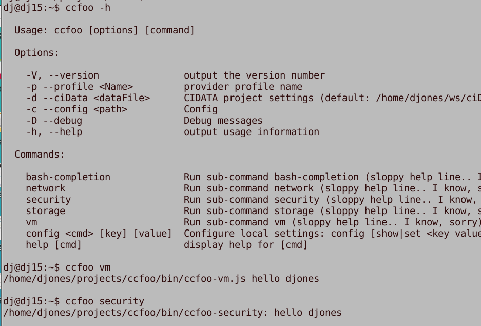

# [ccfoo]
Does this work? No, Im just testing here.  __[Foo]__ is in the name for a good reason.  This repo is just a nonsense placeholder, for me while I am  experimenting with a new cloud provider, commander CLI, NodeJS,  NPM, oh and vsCode too.

The platform I'm runing on is Linux: 
* Xubuntu 14.4 LTS
* NodeJS v8.11.3
* NPM 6.2.0
* Azure-cli  2.0.32
* jq 1.5-1
* VS Code 1.25.1
* [Commander.js] CLI  framework
  
I don't know that this  will work on a  Windows desktop platform (I expect the JS parts should).

[ccfoo]: https://github.com/djones-home/ccfoo 
[Foo]:https://en.wikipedia.org/wiki/Foobar
[settings.js]: https://github.com/djones-home/ccfoo/blob/master/lib/settings.js
[ccfoo.sj]: https://github.com/djones-home/ccfoo/blob/master/bin/ccfoo.js
[Commander.js]:https://www.npmjs.com/package/commander
[ciStack]:https://incubator2.nps.edu/Tools/ciStack.sh.html

I have a git clone of [ccfoo] in my $workspace. I put a link as follows, in my HOME bin, to make it easy to invoke from bash. I have $HOME/bin in my PATH. 

# Setup and test:

Remember I'm a newbe to NodeJS, - but Linux and Bash are familar friends.

````bash
[ ! -d $HOME/bin ] && mkdir $HOME/bin
echo $PATH | grep -q $HOME/bin || PATH+=:$HOME/bin
workspace=path/to/your/projects
 cd $workspace && 
git clone https://github.com/djones-home/ccfoo

cd ccfoo && npm install &&
ln -s `pwd`/bin/ccfoo.js  $HOME/bin/ccfoo
````

NPM (I believe) could easily have done most if not all of the setup above too - I'm learning. 

To exercise the commander cli code,  make the following two bash functions, which  run  "ccfoo config" commands,  see if it can borrow settings from the azure-cli config, set/delete/show a json file for configuring tool settings.


````bash
setupConfig() {
  x=$(az account show)
  for n in environmentName id user.name tenantId id; do
     echo ccfoo config set ${n/./} $(echo $x | jq -r .${n})
     ccfoo config set ${n/./} $(echo $x | jq -r .${n})
  done 
   ccfoo config show
}
cleanConfig() {
    rm $(ccfoo config show | jq -r .localSettingsFile)
   ccfoo config show
}
````
For example, the "cleanConfig" shell function removes my local ccfoo-config, and then showes defaults that are wired into the ccfoo node package ( in lib/[settings.js]).


````bash
$ cleanConfig
{
  "cert": "/home/jondoe/certs/admin.pem",
  "ca": "/home/jondoe/certs/ca-crt.pem",
  "passphrase": "redacted",
  "baseUrl": "https://ci10.example.com/app",
  "uri": "/widget",
  "localSettingsFile": "/home/jondoe/.config/ccfoo/config.json"
}
````

Now take my settings from the azure-cli - just robbing it blind :-),

````bash
$ cleanConfig >/dev/null; setupConfig
ccfoo config set environmentName AzureUSGovernment
ccfoo config set id guid-gibbrish
ccfoo config set username jondoes@componay.onmicrosoft.com
ccfoo config set tenantId guid-gibbrish
ccfoo config set id gid-gibbrish
{
  "cert": "/home/jdoe/certs/admin.pem",
  "ca": "/home/jdoe/certs/ca-crt.pem",
  "passphrase": "redacted",
  "baseUrl": "https://ci10.eample.com/app",
  "uri": "/widget",
  "localSettingsFile": "/home/jdoe/.config/ccfoo/config.json",
  "environmentName": "AzureUSGovernment",
  "id": "... guid-jibbirsh ...",
  "username": "jdoe@company.onmicrosoft.com",
  "tenantId": "... guid-gibbrish ..."
}
$ cp ~/.azure/accessTokens.json ~/.config/ccfoo/
$ cp ~/.azure/az.json ~/.config/ccfoo/
$ ccfoo config set AZURE_FOO redacted
$ vi ~/.config/ccfoo/config.json


````

# Now what?
I want to take a few user functions from a facade interface written in bash, for one cloud provider,  refactor these bash-based user functions, make them work for AWS and Azure cloud providers.

Back in the ccfoo/bin folder:  
 * [ccfoo-vm.js] the main script
 * ccfoo-cmd a hello user scirpt
 * ccfoo-[vm,network,security] likewise say hello

  The "config" command, is known as an "action" based command in commander.js terminology:
  




To write it in less code, we take advantage of the JS ecosystem, as shown here W/ commander does  all the command/option parsing and generation of useage help.

# User Functions

### Background on the Bash Tool to be Upgraded 

 The [ciStack]  function is the main driver for this shell library. 
 Together with templates, it is used to manage a project resource stack, from one provider service, AWS EC2 service.
 The rational for ciStack is to provide a facade interface, to reduced risk without roductivity loss.
 Risk is lowered by using IAM policies and roles that implement technical controls. (I believe) productivity is not impacted, prossbly improved
 by the automation and reusability it provides.

 The CIDATA environment variable holds the path to the project settings, encoded in JSON.

 [ciStack] sub-commands render ciData into CLI or SDK operations, based on the provider.
 Using the aws-cli it can :

  - "launch" - creates VM instances for a CI environment in an AWS VPC named by CIDATA.
  - "stop" will request instances of a CI environment in an AWS VPC named by CIDATA, to e stopped.
  - "start"  will request instances of a CI environment in an AWS VPC named by CIDATA, to un.
  - "terminate" - destroys instances of a CI environment in an AWS VPC named by CIDATA.
  - "show" describes instances or resources of a CI environment in an AWS VPC named by IDATA.
  - "help" describes all functions of this module, using the bashDoc function.

 Command completion is supported for Bash, interactively, by sourcing the library.

 Use ciStack to focus on a project-VPC. Run it on an administration node (Bastion), which can assume 
 the IAM-role for that VPC,  to manage AWS resources. 

 Environment: CIDATA is set when given an optional third argument, for examle:
 
  "ciStack show AWS_WASP.json" not only describes instances in project VPC, it also sets IDATA to AWS_WASP.json.
 
 Two IAM Instance Roles are provided by the create_vpc_policy function. If attached to nstances, it provides
 VPC lock-down of allowed operations. Attach the VPC-{vpcName} profile to your Bastion nstance, and the VPC-{vpcName}-ro
 to instances that Bastion users (or applications) should control.  Limit logins to dministrators, or operators for the project,
 on any instance that you assign it the VPC-{vpcName} role.

# Subject tasked sub-commands

One nice upgrade that comes with the [Commander.js] framework, are sub-commands.  VMs are just  one of the subjects, simmilar CRUD-like tasks are applicable to others: on virtual-networking, on cloud storage, on security rules, and users.
A popular CLI pattern is to do  this with sub-commands, like
"mycli cmd-subject sub-command --options". For example:

> ccfoo vm launch -n bastion -u id-gibbrish
> 
> ccfoo network list
> ccfoo

The azure-cli and  aws-cli, use this pattern, of git-like sub-commands.

We are not going to replace "az vm list"  or "aws ec2 describe-instances".

Listing VMs was an exercise to try first, (aside from credrentials) should not be much of a challenge compared to the more needy "launch" command tasks - launchs will need templates and settings, that's the end goal of this exercise, to map external settings (our local settings however we choose) into an Azure resource deployment, or an AWS deployment employ templates, CM, and layered security.